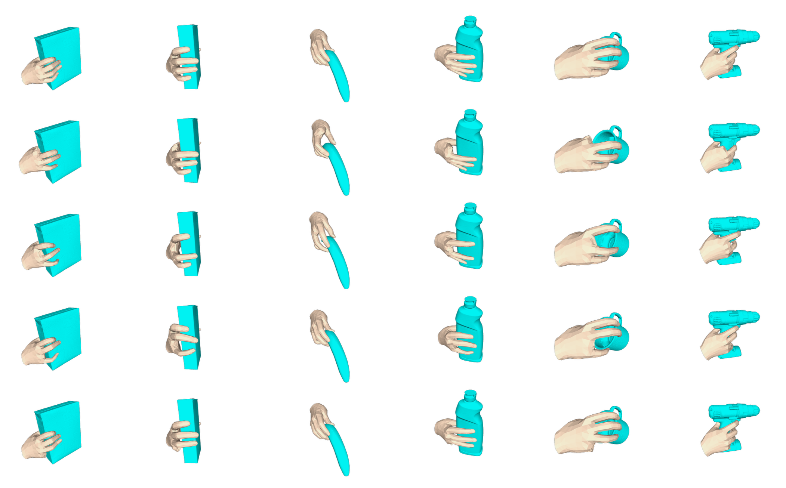

<br />
<p align="center">
  
</p>

<h1 align="center"> ImpairedHand: A Dataset of Hand-Object Interactions under Finger Impairments

# Download Dataset
1. Download the ImpairedHand datasets from the [ImpairedHand Project Page](). You can download specific categories or all the data according to your needs. The data are saved with the path: `ImpairedHand/Object_class/xxxx.json`, look like:
  ```
    .
    └── ImpairedHand
        ├──003_cracker_box
        │   ├──0000.json
        |   |── ...
        |   └──0769.json
        |
        └── ...
   ```
2. The structure in [xxxx.json](assets/data.json) file as follows:
   ```
    .
    ├── xxxx.json
        ├── rhand_mesh                              # the hand mesh
        ├── handBeta                                # a part of MANO param
        ├── handOrient                              # a part of MANO param
        ├── handPose                                # a part of MANO param
        ├── obj_name                                # the class of the object
        ├── obj_transl                              # with the default value: (0,0,0)
        ├── obj_orient                              # with the default value: (1,0,0,0)
        ├── situation_wo2──grasp_score_wo2          # the grasp score of index impairment
        ├── situation_wo2──grasp_score_wo3          # the grasp score of middle impairment
        ├── situation_wo2──grasp_score_wo4          # the grasp score of ring impairment
        ├── situation_wo2──grasp_score_wo5          # the grasp score of pinky impairment
        ├── necessary_points_0.15                   # the importance of each finger
        ├── wo2_finger_position                     # the finger position of index impairment
        ├── wo3_finger_position                     # the finger position of middle impairment
        ├── wo4_finger_position                     # the finger position of ring impairment
        ├── wo5_finger_position                     # the finger position of pinky impairment
        ├── wo2_finger_position_param               # the MANO param of index impairment
        ├── wo3_finger_position_param               # the MANO param of middle impairment
        ├── wo4_finger_position_param               # the MANO param of ring impairment
        └── wo5_finger_position_param               # the MANO param of pinky impairment
   ```

# Data Visualization
- If you want to visualize the hand mesh, a feasible way is to save the value of "rhand_mesh" from the [xxx.json](assets/data.json) as [xxx.obj](assets/hand_mesh.obj) file and visualize it in [MeshLab](https://github.com/cnr-isti-vclab/meshlab), which is also applies to [object mesh](assets/cracker_box.obj).
- The hand model we use following the [this MANO repo](https://github.com/hwjiang1510/MANO), which ports the MANO model files (`mano_v1_2.zip`) from [MANO website](http://mano.is.tue.mpg.de/).
- The object model we use following the [HO-3D object models](https://drive.google.com/file/d/1ZiEsq3NHXv6TPXr9TK8XbxywG_22631a/view?usp=sharing).

# Dataset Constrcut
- We built this dataset based on the HO-3D dataset. We use the [HO-3D dataset](https://1drv.ms/f/s!AsG9HA3ULXQRlFy5tCZXahAe3bEV?e=BevrKO).
- You can run 'ncsy_points.py' to get the necessary_points_0.15, the 'finger_touch_trans.py' to get the finger position under different finger's impairment and the '10234.py' to get the MANO param when the finger position is 10234.
